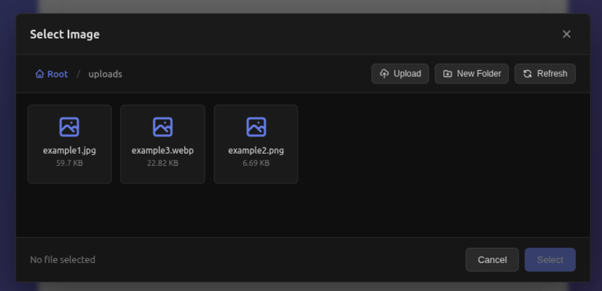

# dynamic-storage-interface

Reusable Astro components for cloud storage file management. Currently implements S3-compatible storage providers (AWS S3, Backblaze B2, MinIO, etc.).

## Components

- **StorageFileBrowser**: Web component for browsing and selecting files from cloud storage
- **StorageImage**: Optimized image component with cloud storage integration
- **StoragePicture**: Responsive picture component with cloud storage support

Notable files:
- `.env.demo` - Example env file
- `/src/pages/index.astro` - Shows basic implementation and usage
- `/src/pages/api/storage.ts` - Storage endpoint
- `/src/lib/api-core.ts` - api setup
- `/src/lib/DynamicStorageAPI/` - Definitions and basic setup for Dynamic storage
- `/src/lib/inMemoryDb/` - files for the in-memory-db example
- `/src/lib/s3/` - files for the S3 driver

## License

[MIT Licensed](./LICENSE)
